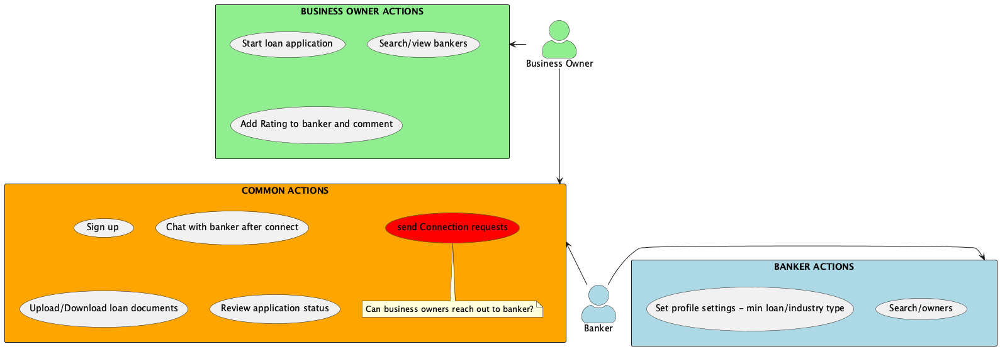

# User Activity Flow
## <u>Actors</u>
- Business Owner
- Banker

## <u>Common action</u>
- Sign up
- Chat
- Send connection request
- Upload/Download loan documents
- Review application status

## <u>Business owner action</u>
- Start loan application
- Search/view bankers
- Add Rating to banker and comment

## <u>Banker action</u>
- Set profile settings. Ex:min loan/industry type
- Search/view owners

