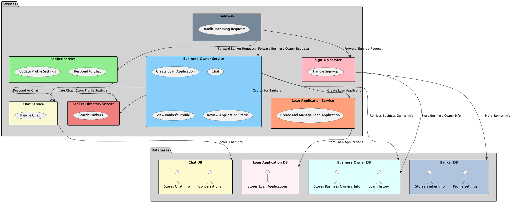

# Architecture Document for B2B Banking Platform

## Overview
This document describes the architecture of the B2B banking platform, focusing on the interactions between various services, their actions, and the associated databases. The platform facilitates interactions between Business Owners and Bankers, allowing them to manage loans and communicate effectively.

## Components

### 1. **Gateway**
- **Description**: The Gateway acts as the entry point for all incoming requests to the system. It is responsible for routing requests to the appropriate services based on the type of user and action.
- **Actions**:
    - Handle incoming requests from Business Owners and Bankers.
    - Forward requests to the relevant services (Sign-up Service, Business Owner Service, Banker Service).

---

### 2. **Sign-up Service**
- **Description**: This service manages user registration for both Business Owners and Bankers.
- **Actions**:
    - Handle sign-up requests for Business Owners.
    - Handle sign-up requests for Bankers.
- **Database**:
    - **Business Owner DB**
        - **Data Stored**:
            - Business Owner personal information (e.g., name, email, contact information).
            - Loan history associated with the Business Owner.
    - **Banker DB**
        - **Data Stored**:
            - Banker personal information (e.g., name, email, contact information).
            - Profile settings and details about products offered.

---

### 3. **Business Owner Service**
- **Description**: This service handles all actions related to Business Owners after their registration.
- **Actions**:
    - Create loan applications.
    - Initiate chat with Bankers.
    - View Banker's profiles.
    - Review the status of loan applications.
- **Database**:
    - **Business Owner DB**
        - **Data Stored**:
            - Business Owner profile information.
            - Loan applications submitted by the Business Owner.
            - Chat history and interactions with Bankers.

---

### 4. **Banker Service**
- **Description**: This service manages actions related to Bankers after they have signed up.
- **Actions**:
    - Update profile settings, including the minimum loan amount and loan products offered.
    - Respond to chat messages from Business Owners.
- **Database**:
    - **Banker DB**
        - **Data Stored**:
            - Banker profile information.
            - Settings for loan products offered and minimum loan amounts.
            - Chat history related to interactions with Business Owners.

---

### 5. **Chat Service**
- **Description**: This service manages chat interactions between Business Owners and Bankers.
- **Actions**:
    - Handle chat initiation and responses.
    - Store chat messages and manage conversations.
- **Database**:
    - **Chat DB**
        - **Data Stored**:
            - Conversation logs between Business Owners and Bankers.
            - Timestamps and message content.

---

### 6. **Loan Application Service**
- **Description**: This service manages loan application processes.
- **Actions**:
    - Create and manage loan applications submitted by Business Owners.
- **Database**:
    - **Loan Application DB**
        - **Data Stored**:
            - Details of loan applications, including amount, type, and status.
            - Association with Business Owner information.

---

### 7. **Banker Directory Service**
- **Description**: This service allows Business Owners to search for available Bankers based on their criteria.
- **Actions**:
    - Search for Bankers who meet specific criteria set by the Business Owners.
- **Database**:
    - **Banker DB**
        - **Data Stored**:
            - Profile information of all registered Bankers.
            - Availability status of Bankers.

---

